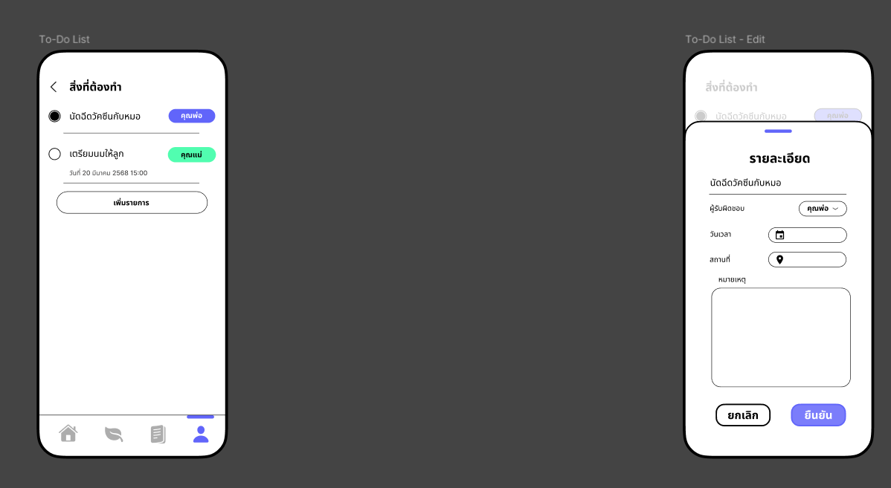
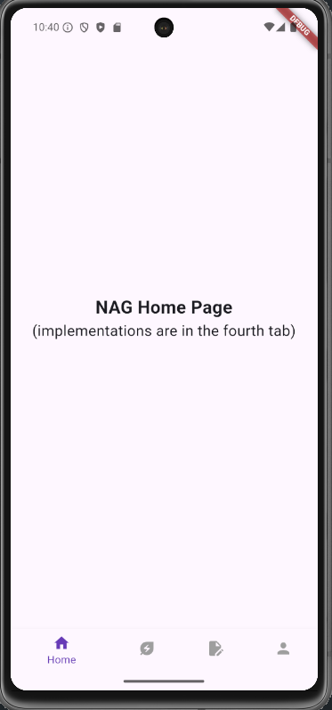
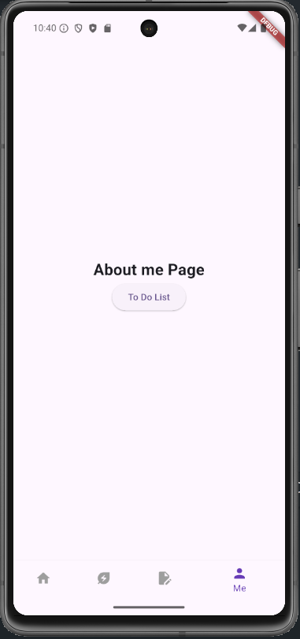
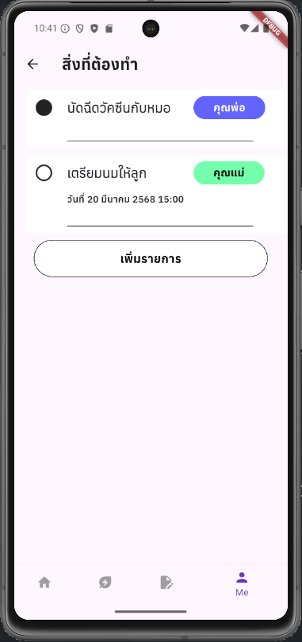
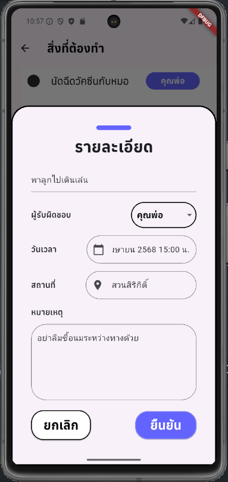

# ITCS424_Implementation_6588008

## Student Information

**Name:** Jakguy Boriboon

**Student ID:** 6588008

**Section:** 1

---

## Pages Implemented

## Figma Design

### 1. Page Name: aboutme  
**Description:** What is the purpose or functionality of this page?

This page currently serves as a placeholder for the actual "About Me" content, which is implemented by another group member. It contains a button that navigates the user to the To-Do List page. The main purpose of this page is to fulfill the navigation requirement of the assignment by demonstrating the use of a BottomNavigationBar to switch between the home page and this page.

### 2. Page Name: todolist  
**Description:** What is the purpose or functionality of this page?

Most of the functionality is in this page. It displays a list of tasks assigned to parents, showing each task’s title, date, and assigned role. Users can tap on a task title to view more details. There is also a button to add new tasks, which opens a modal bottom sheet for inputting task details. Each task can be marked as complete or incomplete by toggling its status.

---

## Features and Widgets Used

Widgets - ModalBottomSheet, GestureDetector, DropdownButton (Caretakerdropdown), Textfield

Layout - Row, Column, Container, SizedBox, Expanded

Material Design - Icons, Colors, style

---

## Known Issues or Limitations

There were several unexpected challenges during development. First, I initially assumed that Flutter provided a built-in calendar widget for selecting date and time, but it does not. So, this feature is currently implemented as a simple text field. Similarly, there is no built-in location selector, so the location input is also just a text field for now.

The toggle for marking a to-do item as complete or incomplete works fine, but it's quite basic. I feel it would benefit from animations or more better icons to improve user experience. Additionally, since there is no dedicated "more info" page designed in flutter, I used a dialog box to display the task details as a temporary solution.

Also, for some reason, I can't type Thai in the emulator. So I'm not sure if Thai works for creating a task item.

---

## Reflection

1. **What did you find most challenging about this project?**  
   
The most challenging aspect of this project was working with Flutter itself. Centering elements, adding padding, and adjusting layouts often felt unintuitive and required a lot of trial and error. Many widgets require specific arguments or nesting that I wasn't initially familiar with, making layout customization time-consuming and sometimes frustrating. The most difficult part was aligning everything to fit the design properly and figuring out the right combination of Row, Column, Expanded, and SizedBox to position elements as intended.

2. **Which widgets or design elements are you most proud of using?**  

I'm most proud of two specific widgets I implemented: the custom CaretakerDropdown and the modal bottom sheet. Flutter somehow found a way to make dropdowns complicated, I had to create a separate stateful widget just to make it work properly, which took quite a bit of time and effort. Despite the challenge, I'm proud that it now functions smoothly. The bottom sheet is another one I'm proud of. I wasn’t aware of this widget before, but after implementing it, I was impressed with how nice it looks at the end.

3. **What would you add or improve with more time?**  

As I mentioned earlier, I would add proper date and location pickers instead of using plain text fields. I’d also improve the visual feedback for marking tasks as complete or incomplete (animations or fading the completed tasks). Additionally, I would implement a dedicated detail page for each task, complete with a map to show the selected location.
